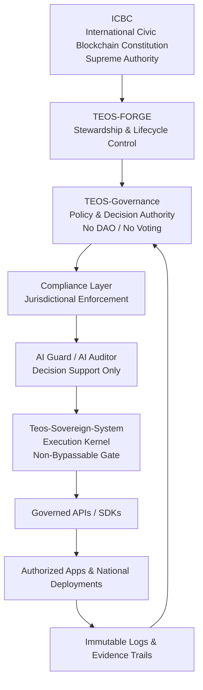

# 🛡️ International Civic Blockchain Constitution (ICBC)
**Technical & Governance Readiness Report — 2026 (Sovereign Edition)**

---



---

## 1. Authority Chain (Governance Logic)

- **Hierarchy:** Constitution → Governance → Execution (Non-Bypassable).
- **Sovereign-by-Design:** Rejects “Code is Law”; **Human Institutional Authority** supersedes all automation.
- **TESL License:** Source-Available under the **TEOS Egypt Sovereign License (TESL)**; prohibits unauthorized forks, rebranding, or autonomous AI governance.
- **Identity Tiers:** Citizen, Institutional, and Founder identities gate access to governance and execution layers, verified via **real-world identity (KYC / national systems)** — never via token stakes.

---

## 2. Technical Stack

### Core Sovereign Contracts (.pi)

- `CivicConstitution.pi`  
  Citizen registration and digital identity anchoring (Pi KYC / National ID).

- `PolicyRatification.pi`  
  **Institutional and lawful ratification mechanisms** — no quadratic voting, no token governance, no DAO logic.

- `SovereignDistribution.pi`  
  **State-authorized sovereign stipends and programmatic disbursements**, executed only under institutional approval.  
  *(Explicitly not UBI experimentation.)*

### Multi-Chain Anchors

- **Solana (Anchor):**  
  Petitions, attestations, and immutable audit logs.

- **Ethereum (Solidity):**  
  `AssetRegistry.sol` for institutional and civic assets with verifiable metadata (CID/IPFS).

### Frontend

- **Constitution Portal (Next.js):**  
  Egyptian civic visual identity (Gold / Turquoise).  
  Identity-gated access only; no public or permissionless interaction surfaces.

---

## 3. Readiness Breakdown

- **Policy & Constitutional Readiness:** ~95%  
  Authority chain, ICBC mandates, UN SDG conceptual alignment, and Egypt-first compliance codified.

- **Institutional Framework:** ~90%  
  Foundational governance artifacts, DPI checklists, risk registers, and lifecycle controls in place.

- **Technical Implementation:** ~80%  
  Identity and audit layers mature; smart contracts auditable but pending sovereign stress testing.

- **Audit & Transparency Layer:** Active  
  Integrity logs, evidence trails, and sovereign vault tracking operational.

---

## 4. Integrity & Compliance Safeguards

- **Integrity Ledger:**  
  All state changes logged immutably.

- **Dual Institutional Verification:**  
  Treasury and vault actions require **two-factor institutional sign-off**.  
  No unilateral private-key authority.

- **AI Constraints:**  
  Artificial Intelligence is **advisory only**.  
  **Zero autonomous execution authority.**

---

## ✅ Verdict

The ICBC repository represents **more than software** — it is a **Sovereign Operating System for Digital Public Infrastructure**.

- **Production-ready** for legal, civic, and institutional frameworks.  
- Suitable for **controlled national or institutional pilots**.  
- Architecturally aligned with global DPI thinking while preserving sovereign authority.  
- Ready for **boardroom, regulator, and policy review**.

---

## 🎨 Visual Authority Chain Diagram — Design Outline

**Purpose:** Instantly communicate *Human Authority > AI > Code*.

### Visual Style
- Top-down hierarchical waterfall.  
- Clear color separation between **human authority** and **technical execution**.

### Layout

1. **[TOP — Gold/Blue] ICBC (The Constitution)**  
   - Icon: Scales of Justice / Egyptian Papyrus  
   - Label: *Supreme Authority (Human / Law)*  
   - Badge: *Sovereign*

2. **↓ Lifecycle Control**  
   - Gate Icon: Stewardship Shield  
   - Label: **TEOS-FORGE**

3. **[Blue] TEOS-Governance**  
   - Icon: Gavel / Policy Document  
   - Badge: *Institutional Ratification*  
   - Note: *No DAO / No Voting*

4. **↓ Jurisdictional Filter**  
   - Gate Icon: Compliance Check

5. **[Green] AI Guard / AI Auditor**  
   - Icon: Locked Robot  
   - Label: *Decision Support Only*

6. **[Dark Grey / Black] Teos-Sovereign-System**  
   - Icon: Engine / Gear  
   - Badge: *Non-Bypassable Runtime Gate*

7. **↓ Governed Execution**

8. **[Turquoise] Apps / Services / National Deployments**  
   - Icon: Nation / Cityscape  
   - Label: *Authorized Endpoints Only*

### Visual Key
- **Gold / Blue:** Human & Sovereign Authority (cannot be automated)  
- **Green:** Safety, audit, and constraint layers  
- **Black:** Execution kernel (follows orders, never makes them)

---

**Authority:** Elmahrosa International  
📧 ayman@teosegypt.com  
🌐 https://teosegypt.com
```
